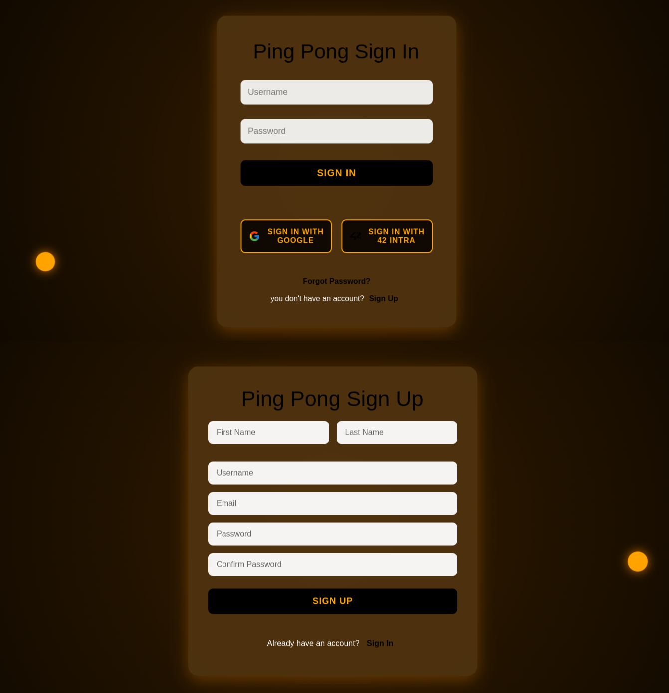
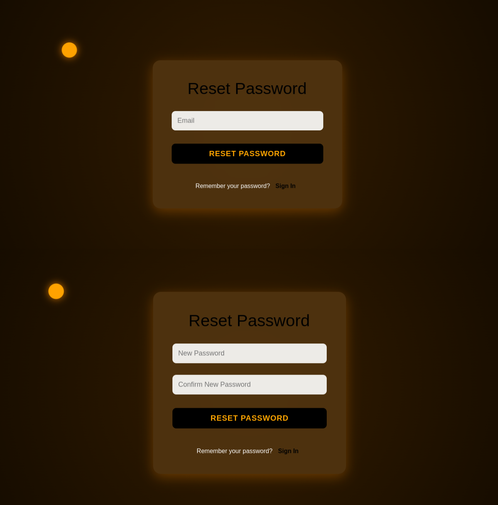
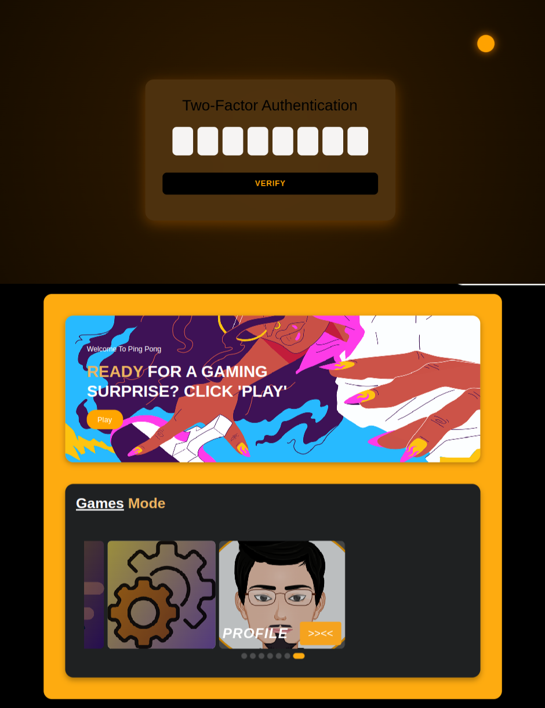
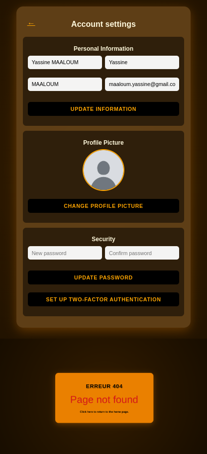
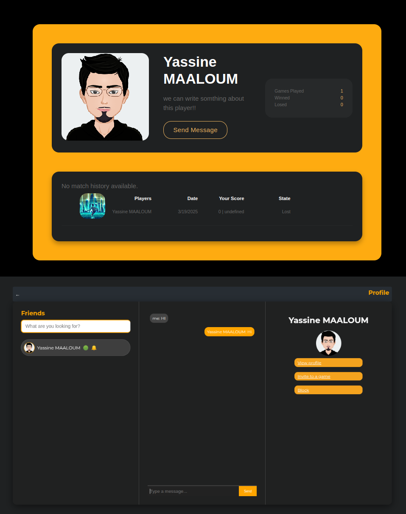
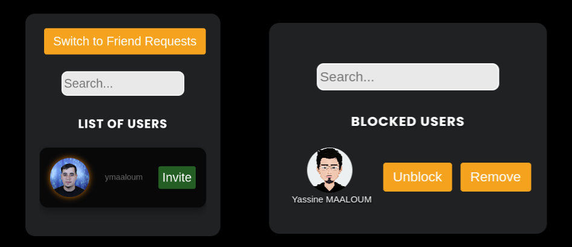
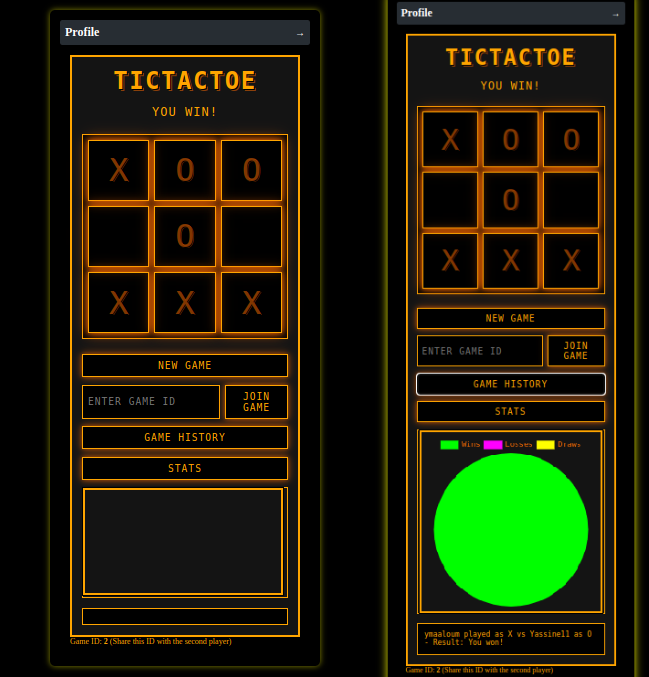
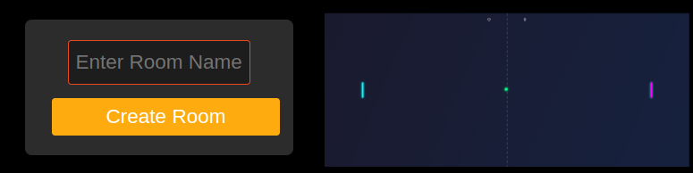
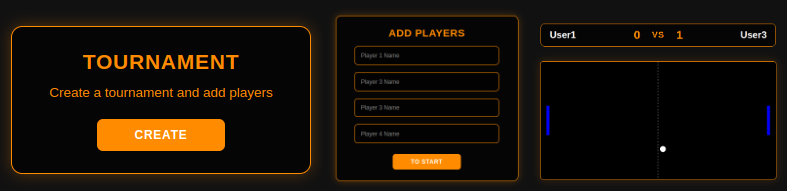

  

## 🎥 Score 🥇✅

  

---

## 🎥 **Demo Video**

  <strong style="font-size: 20px; color: #0073e6;">Click below to watch the Inception42 project:</strong>  
   
  <a href="https://vimeo.com/1065029898" style="font-size: 22px; font-weight: bold; color: #FF6347; text-decoration: none; background-color: #f0f0f0; padding: 15px 30px; border-radius: 8px; border: 2px solid #FF6347;">
    ➡️ **[Watch Transcendence project on Vimeo]** ⬅️
  </a>

---

## Project Overview

### Description
**Transcendence** is a full-stack web application developed with **Django** for the backend and **HTML, CSS, JavaScript (Vanilla JS)** for the frontend. The project includes advanced features such as user management, multi-factor authentication, friend management, a real-time chat system, online games, and a tournament module.

---

## My Tasks 🚀 🛠️

### User Management and Authentication
- **JWT Token Authentication**: I worked on implementing JWT-based authentication to secure API access and manage user sessions.
- **Remote Authentication**: Integrated authentication via Google and Intra42 accounts to allow users to log in using these external services.
- **Sign-Up/Sign-In/Password Reset**: Developed functionalities for standard user sign-up, sign-in, and password reset processes.
- **Two-Factor Authentication (2FA)**: I implemented 2FA to add an additional layer of security to user accounts.

### Friend Management
- **Add/Remove Friends**: Users can send friend requests, accept or decline, and remove friends from their list.
- **Block/Unblock Users**: I implemented the ability for users to block or unblock others, improving privacy and control over their interactions.

### DevOps and Infrastructure
- **PostgreSQL**: Configured and optimized the PostgreSQL database to store user and game data.
- **Redis**: Integrated Redis to cache data and improve performance, especially for the chat system and real-time features.
- **Docker**: Containerized the application to ensure a consistent development and production environment.
- **Nginx with SSL**: Configured Nginx to serve the frontend and handle requests securely with SSL, ensuring encrypted communication.

### Routing
- **Frontend Routing**: I implemented client-side routing in the frontend using JavaScript to create a **Single Page Application (SPA)**. This allows users to navigate between pages like **sign-in**, **sign-up**, **password reset**, and **profile edit** without full page reloads, creating a smoother and faster user experience.
  - I utilized **JavaScript** to handle the URL changes and dynamically load different components based on the route.
  - Managed **URL parameters** and **query strings** to handle actions such as resetting passwords and editing user settings.

- **Backend Routing (Django)**: On the backend, I created and configured the API endpoints using **Django REST Framework** for functionalities such as user management, authentication, and friend management. 
  - I designed and implemented the following API endpoints:
    - **Sign-Up**: Endpoint for creating a new user.
    - **Sign-In**: Endpoint for user login and JWT token issuance.
    - **Password Reset**: Endpoint to request a password reset link.
    - **2FA Authentication**: Endpoint for enabling and verifying two-factor authentication.
    - **Friend Management**: Endpoints for adding, removing, and blocking friends.
    - **User Profile Management**: Endpoint to edit user profile settings, including updating personal information and avatar.

---
## Technologies Used  🛠️

### Backend
- **Django**: Web framework for user management and APIs
- **PostgreSQL**: Relational database for storing information
- **Redis**: Cache to improve performance
- **WebSockets**: Real-time communication for chat and games
- **JWT (JSON Web Token)**: Token-based authentication for secure API access

### Frontend
- **HTML, CSS, JavaScript (Vanilla JS)**: User interface
- **WebSockets**: Real-time communication
- **Single Page Application (SPA)**: The frontend uses the SPA concept to provide a smooth and dynamic experience without full page reloads.

### DevOps
- **Docker**: Application containerization
- **CI/CD**: Automated deployment
- **Nginx**: Web server for serving frontend files and handling requests
- **SSL (Secure Sockets Layer)**: Nginx is configured with SSL to secure communication between the client and server, ensuring data confidentiality and integrity.

---

## Features 🌀

### 1. User Management
- Standard sign-up and login
- Authentication via Google and Intra42
- Two-factor authentication (2FA)
- JWT-based authentication for API security
- User settings management (avatar update, personal information, enable/disable 2FA)

### 2. Friend Management
- Add/remove friends
- Block/unblock users

### 3. Chat System
- Real-time messaging via WebSockets
- Creation of private and public chat rooms

### 4. Online Games
- **Tic-Tac-Toe**: Multiplayer online mode via WebSockets
- **Ping-Pong**: Multiplayer online mode via WebSockets
- Local tournaments between multiple players

### 5. Infrastructure & Deployment
- **PostgreSQL** database
- **Redis** cache to enhance performance
- **Docker** for containerization and deployment
- **Nginx** for serving static files and frontend, configured with **SSL** to secure communication.

---

## Screenshots 📌 🔥

  
  
  
  
  
  
  
  
  

